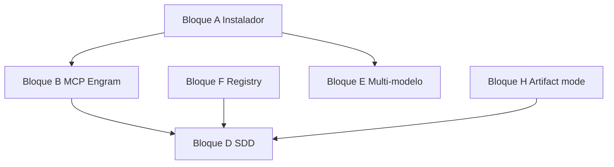

# Mapa: paridad con gentle-ai (intended usage)

**Spec de implementación:** [gentle-ai-implementation-spec.md](./gentle-ai-implementation-spec.md) (Engram MCP, docs CLI, criterios de aceptación).  
**Guías MCP en el fork:** [engram-opencode.md](./engram-opencode.md) (memoria), [context7-opencode.md](./context7-opencode.md) (docs de librerías).

Referencia: [intended-usage.md](https://github.com/Gentleman-Programming/gentle-ai/blob/main/docs/intended-usage.md)  
En este fork el código SDD + assets viven sobre todo en `gentle-ai/`, `.opencode/`, y `packages/opencode/`.

---

## Bloque A — Instalador / onboarding

**Estado:** diferido por ahora (baja prioridad).

**Qué es:** Un flujo tipo “elige agentes, preset y listo”, sin editar configs a mano.

**En el fork:** No hay instalador; se usa el repo + `.opencode/opencode.jsonc`.

**Para acercarte:** CLI de first-run, plantillas por preset, o documentación muy explícita de primeros pasos.

---

## Bloque B — Engram vía MCP (memoria del agente)

**Qué es:** `mem_save`, `mem_search`, `mem_get_observation`, etc., para que el agente persista contexto sin que el usuario lo gestione cada día.

**En el fork:** Los prompts (`gentle-ai/AGENTS.md`, comandos SDD) asumen modo **engram**, pero `mcp` en `.opencode/opencode.jsonc` puede estar vacío: sin servidor Engram conectado, esas herramientas no existen.

**Para acercarte:** Plantilla MCP documentada o generada; verificar que los nombres de tools del servidor coinciden con lo que esperan los prompts.

---

## Bloque C — Engram CLI (tú, no el agente)

**Qué es:** `engram tui`, `engram sync`, `engram projects …`, búsqueda en terminal.

**En el fork:** Es herramienta externa; no va dentro del core de OpenCode.

**Para acercarte:** Documentar como opcional; scripts post-sesión si lo necesitáis en el equipo.

---

## Bloque D — SDD por fases (spec-driven)

**Qué es:** Explore → propose → spec → design → tasks → apply → verify → archive; `/sdd-*` y meta `/sdd-new`, `/sdd-continue`, `/sdd-ff`.

**En el fork:** **Mayormente cubierto:** agentes en config, `packages/opencode/.../sdd-*.txt`, skills en `gentle-ai/skills/`, comandos en `.opencode/commands/`.

**Para acercarte:** Ajustar persistencia (Bloque H) y no asumir solo engram en los templates si quieres openspec/hybrid.

---

## Bloque E — Multi-mode SDD (OpenCode)

**Qué es:** Modelo distinto por fase (ej. potente en diseño, rápido en implementación).

**En el fork:** OpenCode ya soporta **`model` por agente**; el task/subagente usa `agent.model` si existe. Hay guía **[multi-mode-sdd.md](./multi-mode-sdd.md)** y TUI/overlay en **[sdd-models-tui-guide.md](./sdd-models-tui-guide.md)** (`/sdd-models`). Lo que sigue siendo **manual por repo** es rellenar cada `sdd-*` en `.opencode/opencode.jsonc` con los IDs reales de tus proveedores.

**Para acercarte:** Copiar el fragmento de `opencode.jsonc` de la guía y ajustar modelos; verificar en una delegación que el subagente no hereda siempre el modelo del padre.

---

## Bloque F — Skill registry (orquestador → sub-agentes)

**Qué es (no es un daemon):** Un flujo repetible — skill `skill-registry` o la misma lógica dentro de **`sdd-init`** — que:

1. **Escanea** directorios conocidos de skills (globales y del proyecto) buscando `*/SKILL.md`.
2. **Escribe** **`.atl/skill-registry.md`**: tabla de triggers, nombre y **ruta absoluta** al `SKILL.md`, más convenciones del repo (`AGENTS.md`, `.cursorrules`, …).
3. **Opcionalmente** guarda el mismo contenido en **Engram** (`mem_save` con topic `skill-registry`) para que el orquestador lo recupere con `mem_search` sin depender solo de disco.

**Quién lee qué (diseño en `gentle-ai/skills/skill-registry/SKILL.md`):**

- El **orquestador** usa el registry **una vez por sesión** para **resolver rutas** y pasarlas al lanzar sub-agentes.
- Los **sub-agentes no leen el catálogo completo**: reciben **rutas ya resueltas** en el prompt de arranque y cargan solo el `SKILL.md` que toca.

**Cuándo se regenera el archivo:** al instalar o quitar skills, bootstrap de proyecto, petición explícita (“actualizar registry”), al correr `sdd-init`, o con **`bun run skill-registry`** desde la raíz del repo. **No** en cada mensaje del chat.

**En el fork (implementado):**

| Pieza | Ubicación |
|-------|-----------|
| Generador (disco) | `gentle-ai/lib/skill-registry.ts` + `gentle-ai/script/skill-registry.ts`; script npm **`skill-registry`** en el `package.json` raíz. |
| Inyección al orquestador | Plugin **`gentle-ai/plugins/skill-registry-plugin.ts`**: inyecta **`.atl/skill-registry.md`** en el system del agente **`sdd-orchestrator`** **una vez por sesión**; si el archivo no existe, lo genera antes de inyectar. Respeta **`small`** (no inyecta en completions “small”). |
| Hook en el core | `experimental.chat.system.transform` recibe **`agent`** y **`small`** (`packages/plugin/src/index.ts`, `packages/opencode/src/session/llm.ts`). |

La **filosofía** operativa sigue en `gentle-ai/AGENTS.md`. **`mem_save`** del topic `skill-registry` en Engram sigue siendo **opcional** (skill / MCP manual), no lo hace el script CLI.

**Para acercarte:** Documentar en el equipo cuándo ejecutar `bun run skill-registry` (tras cambios de skills globales) y si queréis además persistir el mismo markdown en Engram.

---

## Bloque G — Skills en dos capas

**Qué es:** Dos **fuentes** de skills que el registry puede unificar en un solo índice (si el mismo nombre aparece en usuario y proyecto, gana el de **proyecto**).

| Capa | Contenido | Dónde vive |
|------|-----------|------------|
| **1 — SDD + base** | Explore, propose, spec, tasks, `skill-registry`, etc. | Embebidos en **`gentle-ai/skills/`** (vendored en el fork). |
| **2 — Stack / equipo** | TypeScript, React, testing, etc. | [Gentleman-Skills](https://github.com/Gentleman-Programming/Gentleman-Skills) u otros; **no** van en el árbol del repo: se **copian** a carpetas globales (`~/.cursor/skills`, `~/.config/opencode/skills`, …) o a `skills/` del proyecto según vuestra convención. |

**En el fork:** Capa 1 incluida; capa 2 es **instalación manual** + doc de actualización (`git pull` upstream ocasional).

**Para acercarte:** Proceso de copiar `curated/*` desde Gentleman-Skills y cuándo volver a ejecutar el registry.

---

## Bloque H — Modos de artifact store

**Qué es:** `engram` (por defecto en el doc), `openspec`, `hybrid`, `none`.

**En el fork:** Varios comandos en `.opencode/commands/` declaran **engram** en texto fijo.

**Para acercarte:** Variable de proyecto o plantillas parametrizadas alineadas con los `SKILL.md` que ya describen openspec/hybrid.

---

## Bloque I — Plugins opcionales (gentle-ai)

**Qué hay hoy:** Un plugin concreto, **`gentle-ai/plugins/background-agents.ts`** (export `BackgroundAgents`). No es un “marketplace” de plugins. Origen: adaptación de patrones de **oh-my-opencode** / **opencode-background-agents** (MIT), unificado bajo el nombre `BackgroundAgents`.

**Qué hace ese plugin:**

- Sustituye o complementa el flujo nativo **`task`** con delegación **asíncrona** y **persistencia**: el padre no arrastra todo el output largo en el mismo turno.
- Añade herramientas **`delegate`**, **`delegation_read`**, **`delegation_list`**: el trabajo va a otro **agente**; el resultado queda en disco bajo **`~/.local/share/opencode/delegations/<id-proyecto>/`**; el padre recibe referencias **compactas** al terminar.
- Inyecta en el system prompt las reglas de cuándo usar **`delegate`** vs **`task`**.
- Engancha **compacción** para no perder contexto de delegaciones en curso o recientes.
- Reacciona a **`session.idle`** / **`message.updated`** para cerrar delegaciones y, si hay **`small_model`**, generar título/descripción.
- Al delegar, **respeta el `model` del agente destino** en config (alineado con multi-mode por fase).

**En el fork:** En **`.opencode/opencode.jsonc`** del repo están registrados **`../gentle-ai/plugins/skill-registry-plugin.ts`** y **`../gentle-ai/plugins/background-agents.ts`**. El agente **`sdd-orchestrator`** incluye permisos **`delegate`**, **`delegation_read`** y **`delegation_list`**. Otros clones pueden copiar ese fragmento o dejar `plugin` vacío si no quieren delegación en segundo plano.

---

## Bloque J — Nombre de proyecto / anti-drift (Engram)

**Qué es:** Engram (servidor y CLI) puede **normalizar el nombre del proyecto** (p. ej. desde el remoto git) para que no se fragmente la memoria en “mi-app”, “My-App”, etc.

**En el fork:** OpenCode no implementa esa lógica; depende de **Engram** y de que en `mem_*` uses un **`project`** estable y alineado con lo que Engram espera.

**Qué hacer aquí (documentación):**

- En docs de proyecto: “instala Engram, deja que detecte el proyecto; en prompts/comandos SDD usa siempre el mismo identificador de `project`.”
- Enlazar al repo [engram](https://github.com/Gentleman-Programming/engram) para `engram projects consolidate`, sync, etc.

---

## Aclaraciones (preguntas frecuentes sobre los bloques)

### D — Más explicación: ¿qué es “SDD por fases” en la práctica?

Es un **pipeline de trabajo** para cambios grandes, no para cada línea suelta:

1. **Explorar** el problema y el código (`sdd-explore`).
2. **Proponer** un cambio acotado (`sdd-propose`).
3. **Especificar** requisitos y escenarios (`sdd-spec`).
4. **Diseñar** arquitectura/técnica (`sdd-design`).
5. **Tareas** checklist (`sdd-tasks`).
6. **Implementar** (`sdd-apply`).
7. **Verificar** contra la spec (`sdd-verify`).
8. **Archivar** el cambio cerrado (`sdd-archive`).

Los **meta-comandos** (`/sdd-new`, `/sdd-continue`, `/sdd-ff`) son instrucciones para el **orquestador**: no son skills sueltas; orquestan varias fases vía `task` hacia los subagentes `sdd-*`.

En tu fork eso ya está **modelado**: agentes + prompts + `gentle-ai/AGENTS.md` + comandos en `.opencode/commands/`. Lo que falta para “cerrar el círculo” suele ser **B** (MCP con herramientas `mem_*`) para que la persistencia entre sesiones sea real.

### E — ¿Ya lo tenemos implementado el multi-mode?

**Sí a nivel de plataforma y documentación; el último paso es por repo.**

- Cada entrada en `agent` puede tener `"model": "proveedor/modelo"`. Los subagentes SDD pueden llevar cada uno su modelo. El plugin **BackgroundAgents** lee ese `model` al delegar.
- Hasta que **no** añadas `"model"` a cada `sdd-*` en **tu** `.opencode/opencode.jsonc`, esos agentes **heredan** el modelo por defecto de la sesión.

Para activarlo: **[multi-mode-sdd.md](./multi-mode-sdd.md)** y, si usáis la TUI, **[sdd-models-tui-guide.md](./sdd-models-tui-guide.md)** — rellenar `"model"` por `sdd-*` con **tus** IDs reales.

### F — ¿Lo necesitamos realmente?

**No es obligatorio** para que SDD funcione: cada fase ya tiene su `SKILL.md` en `gentle-ai/skills` y el orquestador puede citar skills por nombre vía el tool `skill`.

**Sí ayuda** si quieres el patrón “muchas skills instaladas (p. ej. TypeScript, React) y el orquestador **pre-resuelve rutas** una vez y se las pasa al sub-agente”, como describe `gentle-ai/AGENTS.md`. Sin registry, el modelo puede ignorar skills de stack o buscarlas con más fricción.

Resumen: **útil para equipos con muchas skills y Gentleman-Skills; prescindible al principio** si solo usáis el set SDD embebido.

### F — ¿El skill registry se “carga” en cada mensaje? (tokens)

**No por diseño**, y encaja con tu objetivo de **mandar pocos tokens a la LLM**:

| Qué | Frecuencia |
|-----|------------|
| **Regenerar** `.atl/skill-registry.md` | Solo cuando cambian skills, proyecto nuevo, o pedís actualizar / `sdd-init` — **no** en cada turno del chat. |
| **Leer** el registry (orquestador) | **Una vez por sesión** en runtime: el plugin inyecta el bloque en el primer turno del agente **`sdd-orchestrator`** (no en cada mensaje). La skill `skill-registry` sigue documentando el mismo contrato para regeneración manual. |
| **Sub-agentes** | **No** reciben el markdown entero del catálogo: reciben **rutas ya resueltas** y leen solo el **`SKILL.md`** que aplica. |

**Cómo mantenerlo “smooth” y barato en tokens:**

- **No** pegues el registry completo en el system prompt de **todos** los agentes: reservalo al **orquestador** o al momento de lanzar `task` / `delegate`.
- Con **Engram**, podéis usar `mem_search` / `mem_get_observation` del topic `skill-registry` **cuando haga falta**, en lugar de repetir el bloque en cada mensaje.
- Si el registry **crece** (muchas filas), seguís pudiendo **acotar** qué filas inyectáis por tarea (solo skills relevantes al turno), aunque eso ya es política de equipo sobre el prompt.

En la práctica, el coste recurrente lo lleva **cada sub-agente leyendo su skill**, no el catálogo entero en bucle.

### G — No tengo idea qué hacer

Opciones concretas (elige según ambición):

1. **Mínimo:** nada; trabajas solo con `gentle-ai/skills`.
2. **Stack extra:** clona [Gentleman-Skills](https://github.com/Gentleman-Programming/Gentleman-Skills), copia carpetas de `curated/` a tu carpeta global de skills (p. ej. `~/.cursor/skills` o la que use OpenCode) y añade esa ruta a `skills.paths` si el esquema lo permite.
3. **Mantener al día:** de vez en cuando `git pull` del upstream `gentle-ai` o del repo Gentleman-Skills y fusionáis skills.

No hace falta código en el fork salvo **documentar** estos tres niveles en el README o en esta guía.

### H — ¿Qué son los “modos de artifact store”?

Es **dónde viven los entregables del SDD** (propuesta, spec, tareas, …):

| Modo | Dónde |
|------|--------|
| **engram** | Memoria MCP (`mem_save` / topic keys `sdd/...`) — lo que asumen hoy tus comandos. |
| **openspec** | Árbol de archivos del repo, típicamente `openspec/changes/...` con markdown/yaml. |
| **hybrid** | Ambos: Engram + archivos (más redundancia, útil para PRs legibles). |
| **none** | Solo en el chat, nada persistido entre sesiones. |

Tus **SKILL.md** ya contemplan esos modos; tus **comandos** en `.opencode/commands/` están fijados a texto “engram”. Implementar **H** sería: o bien un **setting** (“artifact_mode”) y plantillas de comando generadas, o tres variantes de comando. Solo tiene sentido si alguien del equipo **quiere git como fuente de verdad** en vez de solo memoria.

### B y C — Implementación (alcance)

- **B:** Hecho — `mcp.engram` en `.opencode/opencode.jsonc`; detalle en [engram-opencode.md](./engram-opencode.md).
- **C:** Documentado en esa guía (`tui`, `sync`, `projects consolidate`); el binario sigue siendo externo.

---

## Orden sugerido si implementas

1. **B** (MCP Engram usable) — sin esto, “memoria automática” del doc no se cumple en la práctica.  
2. **F** (registry operativo) — **hecho en el fork** (generador + plugin + hook); opcional **Engram** `mem_save` del topic.  
3. **H** (modos de artifacts) — si necesitáis openspec/hybrid en serio.  
4. **E** (preset multi-modelo) — mejora UX sin tocar filosofía SDD.  
5. **A, C, G, I, J** — producto, docs, y ecosistema externo según prioridad. **I** (BackgroundAgents) está **registrado** en el JSONC del repo; podéis quitarlo si no lo usáis.

---

## Dependencias entre bloques (vista rápida)

*(Si el preview de Mermaid no renderiza en tu visor de MD, el orden en la sección anterior basta.)*
