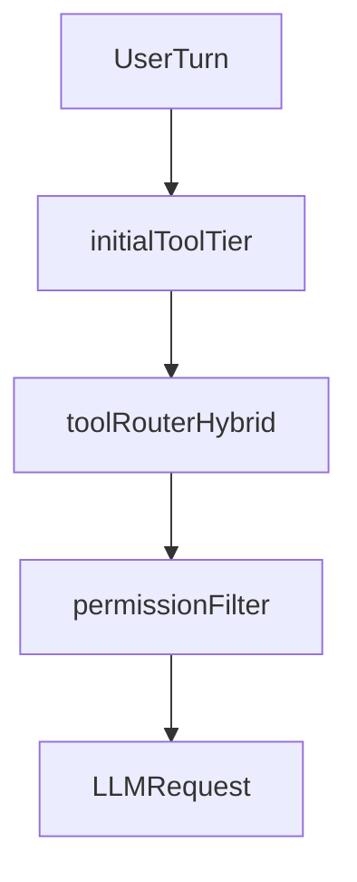

# Lightcode vs OpenCode Upstream (Reproducibilidad)

Este documento describe los cambios de Lightcode respecto a OpenCode upstream y deja un procedimiento claro para volver a aplicar esos cambios en futuras versiones.

> **Nota**: Este documento está actualizado para el fork en `/Users/dev/lightcode-fallback` (rama `fallback`).

## Baseline de comparacion (actualizado 2026-04)

- Upstream remoto: `upstream` -> `https://github.com/anomalyco/opencode.git`
- Rama base: `upstream/dev`
- Commits del fork por delante de upstream: `12` (últimos commits)
- Commits recientes del fork:
  ```
  59aa43123 fix(opencode): keep /features list order stable
  cffec881d feat(opencode): ship experimental features management in CLI/TUI
  c604d3f0a feat(opencode): SDD tool permissions, router web pair, optional hard gates
  2de1784ab fix(opencode): borrar/imperatives — no conversation tier vacío ni bash cortado
  51dd53b2b fix(opencode): align tool router with intent/embed over regex
  7571ed437 feat(opencode): drop minimal tier and base_tools; align TUI context with upstream
  4bca1a23e fix(opencode): seed write from lexical strongWrite for file-creation prompts
  d3f3dc4b7 feat(opencode): offline router tuning, exposure scenario battery, router:eval:scenarios
  4c1e2517d config(fork): tool_router exposure_mode subset_plus_memory_reminder
  4fd3c2ac2 feat(opencode): experimental tool exposure modes after offline router
  2baa39b15 chore: snapshot full codebase on branch fallback
  82ccca5e9 docs: changelog fork router offline, eval y costes (ES)
  ```

## Objetivo del documento

- Servir de guia de merge/rebase desde `upstream/dev` sin perder comportamiento del fork.
- Servir de checklist para reproducir Lightcode sobre un clon limpio de OpenCode.

## Mapa de cambios por area

| Area | Que cambio | Archivos ancla |
| --- | --- | --- |
| Legal y atribucion | Se agrega atribucion explicita del derivado Lightcode y cadena de credito a upstream. | `LICENSE`, `NOTICE` |
| Entorno portable del fork | Carga temprana de `fork.opencode.env`, expansion de variables de entorno, raiz portable y manejo de rutas robusto para binario/exec path. | `fork.opencode.env`, `packages/opencode/src/util/fork-env.ts`, `packages/opencode/src/global/index.ts`, `packages/opencode/bin/opencode` |
| Tool router offline + embeddings | Router **Xenova-only estricto**: embeddings locales obligatorios, sin fallback a reglas keyword, sin fallback a LLM router y sin fallback passthrough. Si Xenova/IPC falla, la ruta falla. | `packages/opencode/src/session/tool-router.ts`, `packages/opencode/src/session/initial-tool-tier.ts`, `packages/opencode/src/session/router-embed.ts`, `packages/opencode/src/session/router-embed-impl.ts`, `packages/opencode/src/session/router-embed-ipc.ts`, `packages/opencode/src/session/wire-tier.ts` |
| Sesion, prompt y LLM | Se reajusta el pipeline de herramientas/sistema para trabajar con tier inicial, router y caching de prompt; incluye logging de request/debug. | `packages/opencode/src/session/llm.ts`, `packages/opencode/src/session/prompt.ts`, `packages/opencode/src/session/message-v2.ts`, `packages/opencode/src/session/system-prompt-cache.ts`, `packages/opencode/src/session/debug-request.ts` |
| Config y flags | Se extiende schema/config experimental para router/tier y nuevas rutas de comportamiento en runtime. | `packages/opencode/src/config/config.ts`, `packages/opencode/src/flag/flag.ts` |
| Agentes SDD en core | Se agregan/promueven prompts y wiring de agentes SDD para orquestacion y subagentes especializados. | `packages/opencode/src/agent/agent.ts`, `packages/opencode/src/agent/prompt/sdd-orchestrator.txt`, `packages/opencode/src/agent/prompt/` |
| Plugin API | Se amplian hooks de chat para pasar contexto de agente y modo "small" al transform del system prompt. | `packages/plugin/src/index.ts` |
| TUI y UX | Se agregan overlays/perfiles SDD y metricas de consumo/contexto en TUI. | `packages/opencode/src/cli/cmd/tui/component/dialog-sdd-models.tsx`, `packages/opencode/src/cli/cmd/tui/component/dialog-meter.tsx`, `packages/opencode/src/cli/cmd/tui/util/session-usage.ts` |
| App web | Se exponen metricas/sincronizacion y estado local embed en UI web. | `packages/app/src/components/local-embed-status.tsx`, `packages/app/src/context/global-sync.tsx`, `packages/app/src/lib/session-usage.ts` |
| SDK/OpenAPI | Se sincronizan tipos generados y surface OpenAPI para nuevos campos/eventos. | `packages/sdk/js/src/v2/gen/types.gen.ts`, `packages/sdk/openapi.json`, `packages/opencode/src/cli/openapi-emit.ts` |
| Dependencias router embed | Se introducen dependencias y scripts para `transformers` + `onnxruntime` y linking de runtime. | `packages/opencode/package.json`, `packages/opencode/script/link-onnxruntime-for-bun.mjs`, `packages/opencode/script/router-embed-worker.ts` |
| Capa Gentle AI vendorizada | Se incorpora capa completa de skills/plugins/comandos SDD del fork. | `gentle-ai/`, `gentle-ai/plugins/background-agents.ts`, `gentle-ai/plugins/skill-registry-plugin.ts`, `gentle-ai/AGENTS.md` |
| Config de proyecto del fork | Se customiza configuracion de agentes, MCP, comandos y perfiles SDD a nivel repo. | `.opencode/opencode.jsonc`, `.opencode/commands/`, `.opencode/sdd-models.jsonc` |
| Scripts de operacion | Se agregan scripts de arranque aislado, chequeo de embed-node y ajustes de build/dev CLI. | `scripts/opencode-isolated.sh`, `scripts/check-router-embed-node.ts`, `script/build-cli.ts`, `script/dev-cli.ts` |
| Tests de regresion | Se agrega cobertura extensa para router/tier/embed y flujo de sesion. | `packages/opencode/test/session/tool-router.test.ts`, `packages/opencode/test/session/router-embed.test.ts`, `packages/opencode/test/session/initial-tool-tier.test.ts`, `packages/opencode/test/session/wire-tier.test.ts` |
| Documentacion de fork | Se agregan guias tecnicas y operativas para soporte y portabilidad del fork. | `docs/`, `README.md`, `opencode arch analysis.md` |
| **Nuevos tools (2026-04)** | Se agregan tools experimentales: browser, workflow, cron, team, tool_search | `packages/opencode/src/tool/browser.ts`, `packages/opencode/src/tool/workflow.ts`, `packages/opencode/src/tool/cron.ts`, `packages/opencode/src/tool/team.ts`, `packages/opencode/src/tool/tool_search.ts` |
| **Features CLI/TUI (2026-04)** | Sistema de management de experimental features con CLI `/features` y TUI dialog | `packages/opencode/src/cli/cmd/features.ts`, `packages/opencode/src/cli/cmd/tui/component/dialog-features.tsx`, `packages/opencode/src/config/config.ts`, `packages/opencode/src/command/index.ts` |
| **Tool Exposure Modes (2026-04)** | 5 modos de exposure: per_turn_subset, memory_only_unlocked, stable_catalog_subset, subset_plus_memory_reminder, session_accumulative_callable | `packages/opencode/src/session/tool-router.ts`, `packages/opencode/src/config/config.ts` |
| **SDD Permissions + Hard Gates (2026-04)** | Permisos granulares para agentes SDD, hard gates configurables, web pair para research intents | `packages/opencode/src/agent/agent.ts`, `packages/opencode/src/session/router-policy.ts`, `.opencode/opencode.jsonc` |

## Flujo tecnico clave (router)



## Contrato Xenova-only (estado actual)

El router del fork debe comportarse con estas reglas:

- `tool-router` usa embeddings locales de Xenova como corazon semantico.
- No hay fallback a regex keyword rules.
- No hay fallback a augmentation con modelo small/LLM.
- No hay fallback IPC->inprocess para embeddings: si falla IPC, se propaga error.
- No hay fallback "empty passthrough" a todo el set de tools cuando no hay match.

Archivos relevantes:

- `packages/opencode/src/session/tool-router.ts`
- `packages/opencode/src/session/router-embed.ts`
- `packages/opencode/src/session/router-embed-impl.ts`

Benchmark offline del grid `exact_match` (objetivo: **maximizar acierto exacto** entre combinaciones de flags; metricas y comandos): `docs/tool-router-exact-match-benchmark.md`.

Opciones legacy que ya no son fuente de verdad del comportamiento:

- `experimental.tool_router.keyword_rules`
- `experimental.tool_router.no_match_fallback`
- `experimental.tool_router.no_match_fallback_tools`
- `experimental.tool_router.mode` (rules/hybrid) para decidir fallback de router
- ruta de fallback a `router-llm`

## Comportamientos criticos que hay que preservar

1. `fork.opencode.env` se carga antes de resolver paths globales; `OPENCODE_ROUTER_EMBED_NODE` no debe quedar fijada a rutas obsoletas de entorno externo.
2. El router debe operar desde turno 1 con tier minimal y escalado por intencion usando Xenova (sin degradar a reglas/LLM/passthrough).
3. El pipeline de sesion debe conservar coherencia entre tier/router/promptHint/caching para no romper tool selection ni consumo de tokens.
4. Los hooks de plugin de system prompt deben recibir metadatos de agente y modo small para compatibilidad con orquestacion SDD.
5. Los cambios de SDK/OpenAPI deben regenerarse cada vez que cambie el schema de eventos/tipos expuestos.
6. Los nuevos tools (browser, workflow, cron, team, tool_search) requieren permisos apropiados en agentes.
7. El sistema de features debe persistir correctamente y aplicar cambios inmediatamente.
8. Los Tool Exposure Modes deben mantener backwards compatibility con el modo default.

## Procedimiento para portar a futuras versiones upstream

1. Sincronizar repositorio y base:
   - `git fetch upstream`
   - `git fetch origin`
2. Verificar baseline:
   - `git merge-base upstream/dev HEAD`
   - `git rev-parse upstream/dev`
   - `git rev-parse HEAD`
3. Integrar upstream:
   - `git checkout dev`
   - `git merge upstream/dev`
4. Resolver conflictos primero en archivos de mayor riesgo:
   - `packages/opencode/src/session/llm.ts`
   - `packages/opencode/src/session/prompt.ts`
   - `packages/opencode/src/session/message-v2.ts`
   - `packages/opencode/src/session/tool-router.ts`
   - `packages/opencode/src/config/config.ts`
   - `packages/opencode/bin/opencode`
   - `packages/opencode/src/global/index.ts`
5. Reaplicar o validar capas del fork:
   - `gentle-ai/`
   - `.opencode/`
   - `fork.opencode.env`
6. Regenerar SDK JS:
   - `./packages/sdk/js/script/build.ts`
7. Verificar tipado y tests en paquete correcto:
   - `cd packages/opencode && bun typecheck`
   - `cd packages/opencode && bun test`

## Comandos de auditoria rapida (repetibles)

```bash
# Ver commits ahead de upstream
git log upstream/dev..HEAD --oneline
```

```bash
# Ver diff stats
git diff upstream/dev...HEAD --stat
git diff --shortstat upstream/dev...HEAD
git diff --numstat upstream/dev...HEAD | awk '{add+=$1; del+=$2} END {print add" "del}'
```

```bash
# Verificar y testear
cd packages/opencode
bun typecheck
bun test
```

## Diferenciar historial vs WIP local

Este documento cubre el diferencial historico `upstream/dev...HEAD`. 

**Cambios sin commit actuales en este fork (2026-04):**
- `opencode arch analysis.md` (actualizado)
- `packages/opencode/opencode.json`
- `packages/opencode/src/cli/cmd/features.ts`
- `packages/opencode/src/cli/cmd/tui/component/dialog-features.tsx`

Si vas a portar el fork a una version nueva, decide primero si esos WIP entran en el baseline oficial o se mantienen fuera del port.

## Que no forma parte del nucleo de port tecnico

- Artefactos de notas/logs temporales (por ejemplo `*SUMMARY.md`, `exploration.md`, logs de build) no son fuente de verdad para reimplementar comportamiento.
- La capa `gentle-ai/` y gran parte de `.opencode/` puede copiarse como bloque de producto, evitando merge linea-a-linea salvo conflictos claros con core.