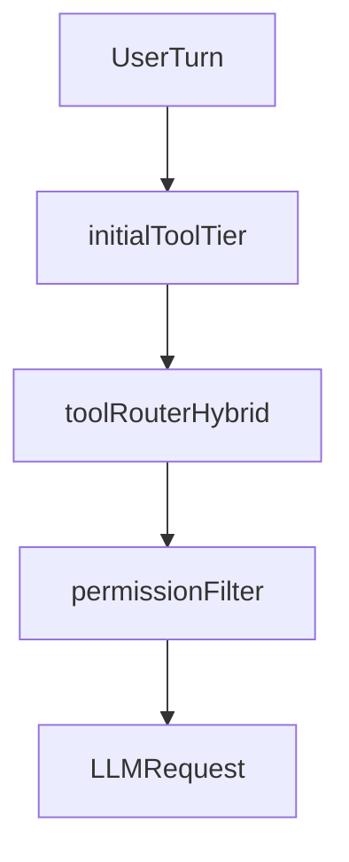

# Lightcode vs OpenCode Upstream (Reproducibilidad)

Este documento describe los cambios de Lightcode respecto a OpenCode upstream y deja un procedimiento claro para volver a aplicar esos cambios en futuras versiones.

## Baseline de comparacion

- Upstream remoto: `upstream` -> `https://github.com/anomalyco/opencode.git`
- Rama base: `upstream/dev`
- Merge-base usado para este analisis: `5d2dc8888cc8e06d34c30ed3a1a9765cb76b0904`
- Head del fork analizado: `5f10ebc30c3631a7d1d3432d63514682b3b84e6f`
- Commits del fork por delante de upstream: `42`
- Tamano del diff `upstream/dev...HEAD`: `218 files changed, 23018 insertions(+), 1328 deletions(-)`

## Objetivo del documento

- Servir de guia de merge/rebase desde `upstream/dev` sin perder comportamiento del fork.
- Servir de checklist para reproducir Lightcode sobre un clon limpio de OpenCode.

## Mapa de cambios por area

| Area | Que cambio | Archivos ancla |
| --- | --- | --- |
| Legal y atribucion | Se agrega atribucion explicita del derivado Lightcode y cadena de credito a upstream. | [`/Users/dev/lightcode/LICENSE`](/Users/dev/lightcode/LICENSE), [`/Users/dev/lightcode/NOTICE`](/Users/dev/lightcode/NOTICE) |
| Entorno portable del fork | Carga temprana de `fork.opencode.env`, expansion de variables de entorno, raiz portable y manejo de rutas robusto para binario/exec path. | [`/Users/dev/lightcode/fork.opencode.env`](/Users/dev/lightcode/fork.opencode.env), [`/Users/dev/lightcode/packages/opencode/src/util/fork-env.ts`](/Users/dev/lightcode/packages/opencode/src/util/fork-env.ts), [`/Users/dev/lightcode/packages/opencode/src/global/index.ts`](/Users/dev/lightcode/packages/opencode/src/global/index.ts), [`/Users/dev/lightcode/packages/opencode/bin/opencode`](/Users/dev/lightcode/packages/opencode/bin/opencode) |
| Tool router offline + embeddings | Router **Xenova-only estricto**: embeddings locales obligatorios, sin fallback a reglas keyword, sin fallback a LLM router y sin fallback passthrough. Si Xenova/IPC falla, la ruta falla. | [`/Users/dev/lightcode/packages/opencode/src/session/tool-router.ts`](/Users/dev/lightcode/packages/opencode/src/session/tool-router.ts), [`/Users/dev/lightcode/packages/opencode/src/session/initial-tool-tier.ts`](/Users/dev/lightcode/packages/opencode/src/session/initial-tool-tier.ts), [`/Users/dev/lightcode/packages/opencode/src/session/router-embed.ts`](/Users/dev/lightcode/packages/opencode/src/session/router-embed.ts), [`/Users/dev/lightcode/packages/opencode/src/session/router-embed-impl.ts`](/Users/dev/lightcode/packages/opencode/src/session/router-embed-impl.ts), [`/Users/dev/lightcode/packages/opencode/src/session/router-embed-ipc.ts`](/Users/dev/lightcode/packages/opencode/src/session/router-embed-ipc.ts), [`/Users/dev/lightcode/packages/opencode/src/session/wire-tier.ts`](/Users/dev/lightcode/packages/opencode/src/session/wire-tier.ts) |
| Sesion, prompt y LLM | Se reajusta el pipeline de herramientas/sistema para trabajar con tier inicial, router y caching de prompt; incluye logging de request/debug. | [`/Users/dev/lightcode/packages/opencode/src/session/llm.ts`](/Users/dev/lightcode/packages/opencode/src/session/llm.ts), [`/Users/dev/lightcode/packages/opencode/src/session/prompt.ts`](/Users/dev/lightcode/packages/opencode/src/session/prompt.ts), [`/Users/dev/lightcode/packages/opencode/src/session/message-v2.ts`](/Users/dev/lightcode/packages/opencode/src/session/message-v2.ts), [`/Users/dev/lightcode/packages/opencode/src/session/system-prompt-cache.ts`](/Users/dev/lightcode/packages/opencode/src/session/system-prompt-cache.ts), [`/Users/dev/lightcode/packages/opencode/src/session/debug-request.ts`](/Users/dev/lightcode/packages/opencode/src/session/debug-request.ts) |
| Config y flags | Se extiende schema/config experimental para router/tier y nuevas rutas de comportamiento en runtime. | [`/Users/dev/lightcode/packages/opencode/src/config/config.ts`](/Users/dev/lightcode/packages/opencode/src/config/config.ts), [`/Users/dev/lightcode/packages/opencode/src/flag/flag.ts`](/Users/dev/lightcode/packages/opencode/src/flag/flag.ts) |
| Agentes SDD en core | Se agregan/promueven prompts y wiring de agentes SDD para orquestacion y subagentes especializados. | [`/Users/dev/lightcode/packages/opencode/src/agent/agent.ts`](/Users/dev/lightcode/packages/opencode/src/agent/agent.ts), [`/Users/dev/lightcode/packages/opencode/src/agent/prompt/sdd-orchestrator.txt`](/Users/dev/lightcode/packages/opencode/src/agent/prompt/sdd-orchestrator.txt), [`/Users/dev/lightcode/packages/opencode/src/agent/prompt/`](/Users/dev/lightcode/packages/opencode/src/agent/prompt/) |
| Plugin API | Se amplian hooks de chat para pasar contexto de agente y modo "small" al transform del system prompt. | [`/Users/dev/lightcode/packages/plugin/src/index.ts`](/Users/dev/lightcode/packages/plugin/src/index.ts) |
| TUI y UX | Se agregan overlays/perfiles SDD y metricas de consumo/contexto en TUI. | [`/Users/dev/lightcode/packages/opencode/src/cli/cmd/tui/component/dialog-sdd-models.tsx`](/Users/dev/lightcode/packages/opencode/src/cli/cmd/tui/component/dialog-sdd-models.tsx), [`/Users/dev/lightcode/packages/opencode/src/cli/cmd/tui/component/dialog-meter.tsx`](/Users/dev/lightcode/packages/opencode/src/cli/cmd/tui/component/dialog-meter.tsx), [`/Users/dev/lightcode/packages/opencode/src/cli/cmd/tui/util/session-usage.ts`](/Users/dev/lightcode/packages/opencode/src/cli/cmd/tui/util/session-usage.ts) |
| App web | Se exponen metricas/sincronizacion y estado local embed en UI web. | [`/Users/dev/lightcode/packages/app/src/components/local-embed-status.tsx`](/Users/dev/lightcode/packages/app/src/components/local-embed-status.tsx), [`/Users/dev/lightcode/packages/app/src/context/global-sync.tsx`](/Users/dev/lightcode/packages/app/src/context/global-sync.tsx), [`/Users/dev/lightcode/packages/app/src/lib/session-usage.ts`](/Users/dev/lightcode/packages/app/src/lib/session-usage.ts) |
| SDK/OpenAPI | Se sincronizan tipos generados y surface OpenAPI para nuevos campos/eventos. | [`/Users/dev/lightcode/packages/sdk/js/src/v2/gen/types.gen.ts`](/Users/dev/lightcode/packages/sdk/js/src/v2/gen/types.gen.ts), [`/Users/dev/lightcode/packages/sdk/openapi.json`](/Users/dev/lightcode/packages/sdk/openapi.json), [`/Users/dev/lightcode/packages/opencode/src/cli/openapi-emit.ts`](/Users/dev/lightcode/packages/opencode/src/cli/openapi-emit.ts) |
| Dependencias router embed | Se introducen dependencias y scripts para `transformers` + `onnxruntime` y linking de runtime. | [`/Users/dev/lightcode/packages/opencode/package.json`](/Users/dev/lightcode/packages/opencode/package.json), [`/Users/dev/lightcode/packages/opencode/script/link-onnxruntime-for-bun.mjs`](/Users/dev/lightcode/packages/opencode/script/link-onnxruntime-for-bun.mjs), [`/Users/dev/lightcode/packages/opencode/script/router-embed-worker.ts`](/Users/dev/lightcode/packages/opencode/script/router-embed-worker.ts) |
| Capa Gentle AI vendorizada | Se incorpora capa completa de skills/plugins/comandos SDD del fork. | [`/Users/dev/lightcode/gentle-ai/`](/Users/dev/lightcode/gentle-ai/), [`/Users/dev/lightcode/gentle-ai/plugins/background-agents.ts`](/Users/dev/lightcode/gentle-ai/plugins/background-agents.ts), [`/Users/dev/lightcode/gentle-ai/plugins/skill-registry-plugin.ts`](/Users/dev/lightcode/gentle-ai/plugins/skill-registry-plugin.ts), [`/Users/dev/lightcode/gentle-ai/AGENTS.md`](/Users/dev/lightcode/gentle-ai/AGENTS.md) |
| Config de proyecto del fork | Se customiza configuracion de agentes, MCP, comandos y perfiles SDD a nivel repo. | [`/Users/dev/lightcode/.opencode/opencode.jsonc`](/Users/dev/lightcode/.opencode/opencode.jsonc), [`/Users/dev/lightcode/.opencode/commands/`](/Users/dev/lightcode/.opencode/commands/), [`/Users/dev/lightcode/.opencode/sdd-models.jsonc`](/Users/dev/lightcode/.opencode/sdd-models.jsonc) |
| Scripts de operacion | Se agregan scripts de arranque aislado, chequeo de embed-node y ajustes de build/dev CLI. | [`/Users/dev/lightcode/scripts/opencode-isolated.sh`](/Users/dev/lightcode/scripts/opencode-isolated.sh), [`/Users/dev/lightcode/scripts/check-router-embed-node.ts`](/Users/dev/lightcode/scripts/check-router-embed-node.ts), [`/Users/dev/lightcode/script/build-cli.ts`](/Users/dev/lightcode/script/build-cli.ts), [`/Users/dev/lightcode/script/dev-cli.ts`](/Users/dev/lightcode/script/dev-cli.ts) |
| Tests de regresion | Se agrega cobertura extensa para router/tier/embed y flujo de sesion. | [`/Users/dev/lightcode/packages/opencode/test/session/tool-router.test.ts`](/Users/dev/lightcode/packages/opencode/test/session/tool-router.test.ts), [`/Users/dev/lightcode/packages/opencode/test/session/router-embed.test.ts`](/Users/dev/lightcode/packages/opencode/test/session/router-embed.test.ts), [`/Users/dev/lightcode/packages/opencode/test/session/initial-tool-tier.test.ts`](/Users/dev/lightcode/packages/opencode/test/session/initial-tool-tier.test.ts), [`/Users/dev/lightcode/packages/opencode/test/session/wire-tier.test.ts`](/Users/dev/lightcode/packages/opencode/test/session/wire-tier.test.ts) |
| Documentacion de fork | Se agregan guias tecnicas y operativas para soporte y portabilidad del fork. | [`/Users/dev/lightcode/docs/`](/Users/dev/lightcode/docs/), [`/Users/dev/lightcode/README.md`](/Users/dev/lightcode/README.md), [`/Users/dev/lightcode/README.upstream.md`](/Users/dev/lightcode/README.upstream.md) |

## Flujo tecnico clave (router)



## Contrato Xenova-only (estado actual)

El router del fork debe comportarse con estas reglas:

- `tool-router` usa embeddings locales de Xenova como corazon semantico.
- No hay fallback a regex keyword rules.
- No hay fallback a augmentation con modelo small/LLM.
- No hay fallback IPC->inprocess para embeddings: si falla IPC, se propaga error.
- No hay fallback "empty passthrough" a todo el set de tools cuando no hay match.

Archivos relevantes:

- [`/Users/dev/lightcode/packages/opencode/src/session/tool-router.ts`](/Users/dev/lightcode/packages/opencode/src/session/tool-router.ts)
- [`/Users/dev/lightcode/packages/opencode/src/session/router-embed.ts`](/Users/dev/lightcode/packages/opencode/src/session/router-embed.ts)
- [`/Users/dev/lightcode/packages/opencode/src/session/router-embed-impl.ts`](/Users/dev/lightcode/packages/opencode/src/session/router-embed-impl.ts)

Benchmark offline del grid `exact_match` (objetivo: **maximizar acierto exacto** entre combinaciones de flags; metricas y comandos): [`/Users/dev/lightcode/docs/tool-router-exact-match-benchmark.md`](/Users/dev/lightcode/docs/tool-router-exact-match-benchmark.md).

Opciones legacy que ya no son fuente de verdad del comportamiento:

- `experimental.tool_router.keyword_rules`
- `experimental.tool_router.no_match_fallback`
- `experimental.tool_router.no_match_fallback_tools`
- `experimental.tool_router.mode` (rules/hybrid) para decidir fallback de router
- ruta de fallback a `router-llm`

## Comportamientos criticos que hay que preservar

1. `fork.opencode.env` se carga antes de resolver paths globales; `OPENCODE_ROUTER_EMBED_NODE` no debe quedar fijada a rutas obsoletas de entorno externo.
2. El router debe operar desde turno 1 con tier minimal y escalado por intencion usando Xenova (sin degradar a reglas/LLM/passthrough).
3. El pipeline de sesion debe conservar coherencia entre tier/router/promptHint/caching para no romper tool selection ni consumo de tokens.
4. Los hooks de plugin de system prompt deben recibir metadatos de agente y modo small para compatibilidad con orquestacion SDD.
5. Los cambios de SDK/OpenAPI deben regenerarse cada vez que cambie el schema de eventos/tipos expuestos.

## Procedimiento para portar a futuras versiones upstream

1. Sincronizar repositorio y base:
   - `git fetch upstream`
   - `git fetch origin`
2. Verificar baseline:
   - `git merge-base upstream/dev HEAD`
   - `git rev-parse upstream/dev`
   - `git rev-parse HEAD`
3. Integrar upstream:
   - `git checkout dev`
   - `git merge upstream/dev`
4. Resolver conflictos primero en archivos de mayor riesgo:
   - `packages/opencode/src/session/llm.ts`
   - `packages/opencode/src/session/prompt.ts`
   - `packages/opencode/src/session/message-v2.ts`
   - `packages/opencode/src/session/tool-router.ts`
   - `packages/opencode/src/config/config.ts`
   - `packages/opencode/bin/opencode`
   - `packages/opencode/src/global/index.ts`
5. Reaplicar o validar capas del fork:
   - `gentle-ai/`
   - `.opencode/`
   - `fork.opencode.env`
6. Regenerar SDK JS:
   - `./packages/sdk/js/script/build.ts`
7. Verificar tipado y tests en paquete correcto:
   - `cd /Users/dev/lightcode/packages/opencode && bun typecheck`
   - `cd /Users/dev/lightcode/packages/opencode && bun test`

## Comandos de auditoria rapida (repetibles)

```bash
cd /Users/dev/lightcode
git log upstream/dev..HEAD --oneline
```

```bash
cd /Users/dev/lightcode
git diff upstream/dev...HEAD --stat
git diff --shortstat upstream/dev...HEAD
git diff --numstat upstream/dev...HEAD | awk '{add+=$1; del+=$2} END {print add" "del}'
```

```bash
cd /Users/dev/lightcode/packages/opencode
bun typecheck
bun test
```

## Diferenciar historial vs WIP local

Este documento cubre el diferencial historico `upstream/dev...HEAD`. Ademas, al momento de escribirlo habia cambios sin commit en el working tree:

- `.opencode/opencode.jsonc`
- `bun.lock`
- `fork.opencode.env`
- `gentle-ai/AGENTS.md`
- `package.json`
- `packages/opencode/src/agent/prompt/sdd-orchestrator.txt`
- `packages/opencode/src/bun/index.ts`
- `packages/opencode/src/config/config.ts`
- `packages/opencode/src/session/llm.ts`
- `packages/opencode/src/session/message-v2.ts`
- `packages/opencode/src/session/prompt.ts`
- `packages/opencode/src/session/tool-router.ts`
- `packages/opencode/src/util/fork-env.ts`
- `packages/opencode/test/session/tool-router.test.ts`
- `packages/sdk/js/src/v2/gen/types.gen.ts`

Si vas a portar el fork a una version nueva, decide primero si esos WIP entran en el baseline oficial o se mantienen fuera del port.

## Que no forma parte del nucleo de port tecnico

- Artefactos de notas/logs temporales (por ejemplo `*SUMMARY.md`, `exploration.md`, logs de build) no son fuente de verdad para reimplementar comportamiento.
- La capa `gentle-ai/` y gran parte de `.opencode/` puede copiarse como bloque de producto, evitando merge linea-a-linea salvo conflictos claros con core.
